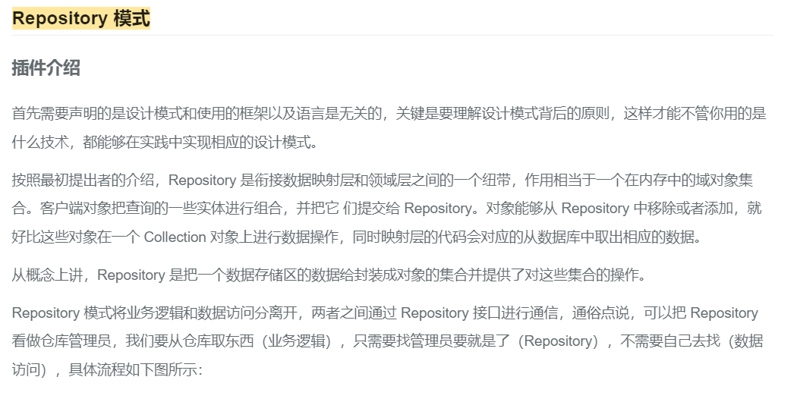

### 开发日志
#### baseModel封装
- 分支 ywz/feat/baseRepository
- 场景：在开发过程中，需要从数据库、redis、es、第三方接口的获取数据。很多时候都是直接在service中调用model或者接口，并没有
一个统一的入口，导致代码中充斥着各种各样的数据获取方式，不利于后期的维护和扩展、复用。
- 解决方案：采用repository + service + controller的方式，将数据获取的逻辑放在repository中。
- 参考链接：[为什么要在 Laravel 中使用存储库模式（Repository）?](https://learnku.com/laravel/t/62521)
- 参考链接：[Repository 模式](https://learnku.com/articles/15453/laravel-rapid-development-tool)
- 在一个repository或者model中，常用的数据操作:增删改查(分页、降序、批量)。
- 未解决：还是不懂repository模式！！！！！！！
- 理解：repository
- 阅读源码(未读):https://github.com/andersao/l5-repository 
